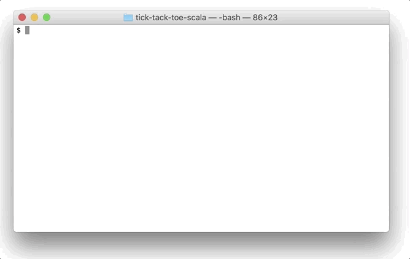

# Tick-Tack-Toe in Scala
[](https://travis-ci.com/nwtgck/tick-tack-toe-scala)

Tick-Tack-Toe written in Scala by using minimax



## Machine vs Machine

```bash
sbt run
```

## Human vs Machine

Random seed: 76  
Circle player: human  
Cross player : default ("minimax")  

```bash
sbt "runMain io.github.nwtgck.ticktacktoe.Main --random-seed=76 --circle=human"
```

NOTE: The "minimax" machine finds **all possible moves**. So you never win this game unless it has a bug.

## Available options

```txt
Usage: Tick Tack Toe [options]

  --random-seed <value>  random seed (default: 10)
  --circle <value>       player of circle ("human" or "minimax")
  --cross <value>        player of cross  ("human" or "minimax")
```
